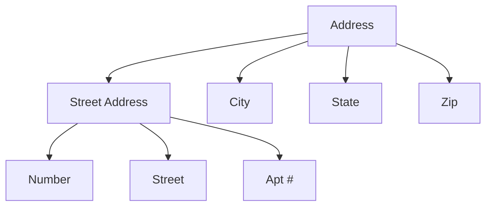

# 範例輸出參考 (Example Output Reference)

這是一份標準的「完整轉換輸出」示例，供 AI 參考輸出水準。

---

## 範例章節：ER 模型屬性 (Attributes in ER Model)

### 核心術語 (Key Terms)

| 英文術語 | 中文 | 一句話解釋 |
| :--- | :--- | :--- |
| Simple Attribute | 簡單屬性 | 不可再細分的單一值，如學號。 |
| Composite Attribute | 複合屬性 | 可拆分為子屬性的值，如地址。 |
| Multivalued Attribute | 多值屬性 | 同一實體可有多個值，如電話號碼。 |
| Derived Attribute | 衍生屬性 | 可從其他屬性計算得出，如年齡。 |
| Key Attribute | 鍵值屬性 | 在實體中唯一識別該實例，如 SSN。 |

---

### 視覺化：複合屬性的樹狀結構

---

### 考點 Callout 示例

> [!important] 設計決策：Address 要用 Simple 還是 Composite？
> 這是一個「設計選擇」，不是屬性的天生性質。
> - 如果程式需要「按城市篩選」→ 用 **Composite**。
> - 如果只是顯示一個地址文字 → 用 **Simple** 即可。

---

### Q&A 示例

**Q：多值屬性與複合屬性有何不同？**
> A：**複合屬性**是「一個值由多個子部分組成」（如地址包含城市、街道）；**多值屬性**是「一個實體在某屬性上可以有多個各自獨立的值」（如一個人有多支手機號碼）。這兩者可以同時存在（如：每個住所 `{住所1, 住所2}` 各自包含地址結構）。
