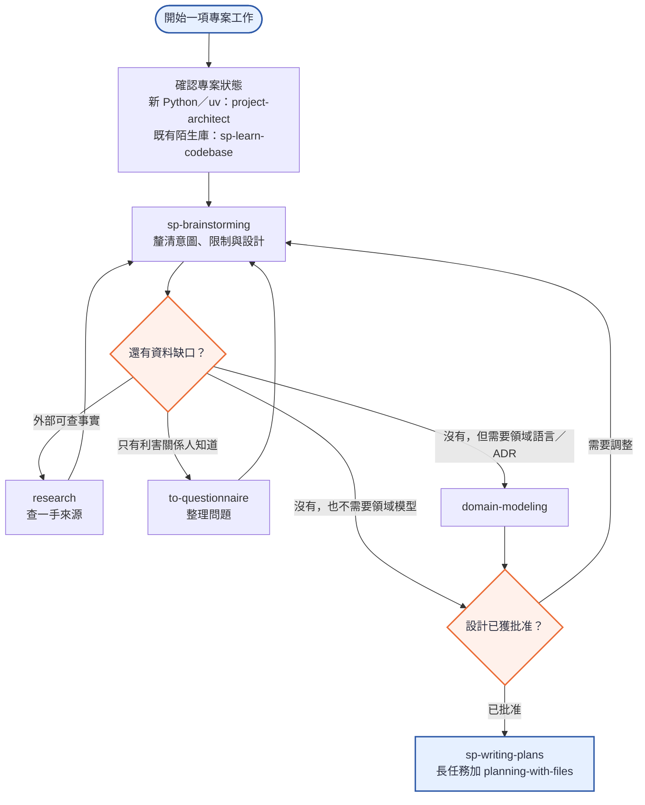
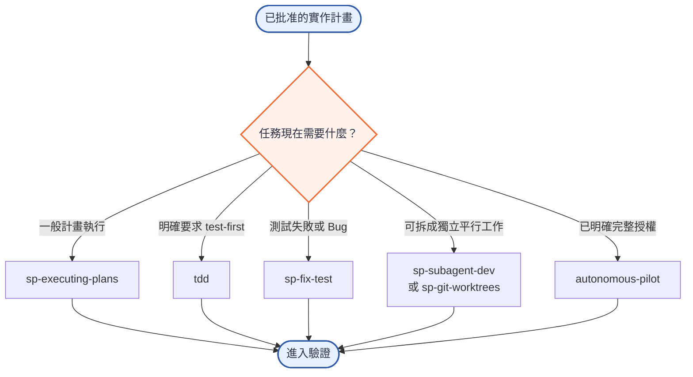
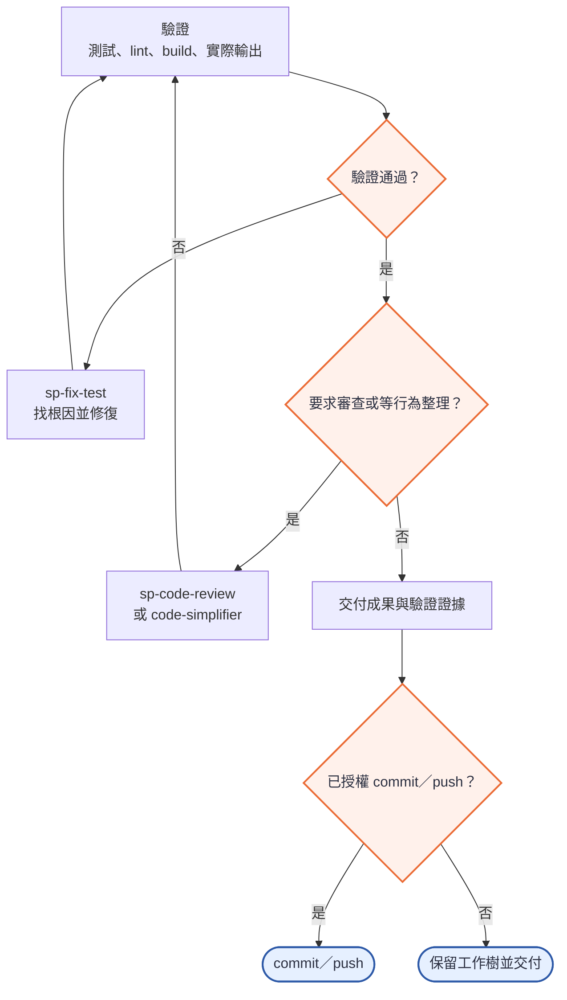

# 專案工作流 v2：依情境選 Skill 🚀

這份工作流適用於新專案、既有程式庫的功能開發與除錯。它不是「每次把所有 Skill 跑一遍」的清單，而是依專案狀態、資料缺口、執行方式與授權範圍選擇最小必要組合。

`ask-matt` 是明確呼叫時才啟用的路由入口；如果已經知道該用哪個 Skill，就直接進入對應階段。

## 核心流程

### A. 理解、設計與計畫

### B. 選擇執行方式

### C. 驗證、品質與交付

三張圖依序銜接；每個決策出口都必須符合線上的條件。不因任務「看起來很大」就自動取得自主執行、平行代理或 Git 發佈權限。`ask-matt`、教學支援、定期架構深化與 Agent 文件維護則按下方表格的條件旁路啟用。

## 階段與觸發條件

| 階段 | Skill | 什麼時候使用 | 主要產出 |
|---|---|---|---|
| 0. 路由 | `ask-matt` | 使用者明確呼叫，且需要判斷下一個 Skill | 一個有理由的下一步建議；不取代實際工作 Skill |
| 1. 建立骨架 | `project-architect` | Python／uv 綠地專案 | uv、Ruff、`CLAUDE.md` 導航與專案基線 |
| 1. 理解既有專案 | `sp-learn-codebase` | 進入陌生或大型既有程式庫 | 架構、依賴與關鍵元件地圖 |
| 2. 釐清設計 | `sp-brainstorming` | 建立功能、改變行為或做創意／開發工作前 | 經使用者批准的需求與設計；批准前不進入實作 |
| 2. 查外部事實 | `research` | 問題可由文件、論文或官方來源回答 | 有來源的研究筆記 |
| 2. 問內部知識 | `to-questionnaire` | 答案只有使用者或利害關係人知道 | 集中且可回答的問題清單 |
| 2. 統一語言 | `domain-modeling` | 術語不一致、領域邊界模糊，或需記錄難逆轉決策 | ubiquitous language、領域模型與 ADR |
| 3. 寫計畫 | `sp-writing-plans` | 需求與設計已明確 | 可執行、可驗證的多步驟計畫 |
| 3. 長任務追蹤 | `planning-with-files` | 工作跨多輪，需保留計畫、發現與進度 | `task_plan.md`、`findings.md`、`progress.md` |
| 4. 一般執行 | `sp-executing-plans` | 已有書面實作計畫 | 依計畫完成的變更與檢查點 |
| 4. 測試先行 | `tdd` | 使用者要求 test-first、red-green-refactor 或整合測試 | 由失敗測試帶動的實作 |
| 4. 修復問題 | `sp-fix-test` | 已有失敗測試、Bug 或不明異常 | 根因、修正與回歸驗證 |
| 4. 平行工作 | `sp-subagent-dev` / `sp-git-worktrees` | 工作可拆成互不踩檔案的獨立模組，且允許代理／worktree | 分離的工作單元與可整合結果 |
| 4. 自主執行 | `autonomous-pilot` | 使用者已明確給予完整自主執行授權 | 按計畫持續執行與檢查點紀錄 |
| 5. 審查 | `sp-code-review` | 使用者要求 review、diff／規格比對或品質審查 | Standards／Spec 雙軸 findings |
| 5. 等行為整理 | `code-simplifier` | 功能已正確，且要求改善清晰度、一致性或維護性 | 行為不變的簡化程式碼 |
| 6. 架構深化 | `improve-architecture` | 定期或明確要求檢查抽象是否白佔位 | 通過 deletion test 的深化機會 |
| ∞. Agent 文件 | `writing-for-agents` | 編寫 Skill、`AGENTS.md` 或 `CLAUDE.md` | 適合代理讀取的清楚指令 |
| ∞. Skill 品質閘門 | `skill-qa-gate` | 建立、修改、審查、commit、push 或發布 Skill 時 | 結構、安全契約、控制語言與語意保留檢查 |

## 教學支援不是開發主線

| 情境 | Skill | 用法 |
|---|---|---|
| 解釋過一次仍沒懂 | `wait-what` | 找出真正卡住的前置概念，再換角度解釋 |
| 想用零背景、圖像優先理解單一主題 | `eli5` | 產生單頁視覺 HTML 說明 |
| 想建立多次、可持續的學習空間 | `teach` | 建立多 session 的學習工作區 |

`teach` 可以涵蓋較長期的教學，但不取代 `eli5` 的單一主題、單頁視覺輸出；兩者按產出形式選用，不需要同時呼叫。

## 五條貫穿全程的原則

1. **事實自己查，決策才問人**：檔案、Git、工具與官方文件能確認的先查；有取捨或只有利害關係人知道的才提問。
2. **設計批准不等於全面授權**：實作、子代理／worktree、`autonomous-pilot`、commit 與 push 各自受原始要求與授權範圍約束。
3. **小步驟必須附證據**：每個步驟用測試、lint、build、實際輸出或外部寫入結果驗證，不能只根據計畫宣稱完成。
4. **只選最小必要 Skill 組合**：沒有領域模型問題就略過 `domain-modeling`；沒有失敗測試就不把 `sp-fix-test` 當成一般 TDD。
5. **回饋失敗就回到正確階段**：規格不清回設計、事實不足回研究、測試失敗回除錯，不用同一種工具硬解所有問題。

## 不屬於這條專案開發流程的項目

`github-stars-radar`、`x-bookmarks-radar`、`threads-bookmarks-radar` 與 `content-radar` 是獨立的內容擷取／排程工作流，應依各自的增量、冪等與 Second Brain 寫入契約執行，不塞進專案開發主線。

---

搭配 [`README.md`](./README.md) 的快速安裝與更新說明使用；Skill 來源與致謝見 [`ACKNOWLEDGEMENTS.md`](./ACKNOWLEDGEMENTS.md)。
