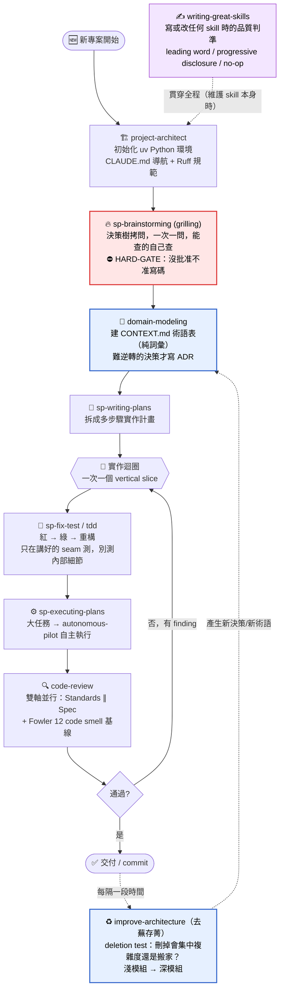

# 新專案工作流：這些 Skill 怎麼串起來用 🚀

一張圖看懂「開一個新專案時，該在哪個階段呼叫哪個 skill」。核心心法（源自 mattpocock）：**回饋速率就是你的速度上限，別接太大的任務**——每一步都留一道回饋閘門。

## 流程圖

## 各階段對照表

| 階段 | Skill | 觸發方式 | 你會得到什麼 |
|---|---|---|---|
| 0. 骨架 | `project-architect` | 手動 | uv 環境、CLAUDE.md 導航、Ruff、日誌追蹤 |
| 1. 釐清需求 | `sp-brainstorming` | 自動（開發前必觸發） | 走完決策樹的共同理解；**未批准前不寫碼** |
| 2. 領域語言 | `domain-modeling` | 需要時 | `CONTEXT.md` 術語表 + `docs/adr/` 決策紀錄 |
| 3. 計畫 | `sp-writing-plans` | 手動 | 多步驟實作計畫 |
| 4. 測試優先 | `sp-fix-test` / `tdd` | 需要時 | 紅綠重構、在正確 seam 上的測試 |
| 5. 執行 | `sp-executing-plans` / `autonomous-pilot` | 手動 | 按計畫實作（大任務自主跑） |
| 6. 審查 | `code-review` | 手動 | Standards / Spec 兩份並排報告 |
| 7. 去蕪存菁 | `improve-architecture` | 手動（定期） | deletion test 篩出的深化機會清單 |
| ∞. 維護 skill | `writing-great-skills` | 參考 | 寫/改 skill 的品質判準 |

## 三條貫穿全程的心法

1. **回饋閘門處處都在**：`sp-brainstorming` 的 HARD-GATE、`tdd` 的紅綠、`code-review` 的雙軸——每一步都在「往下走之前」先確認方向對。
2. **事實自己查，決策才問人**：能從檔案系統 / git / 工具查到的是*事實*，自己查；有取捨、沒唯一解的是*決策*，才丟給人拍板。
3. **語言先於實作**：`CONTEXT.md` 把術語釘死，後面所有 skill（測試命名、審查、架構）都共用同一套詞彙，省 token 也省誤解。

---
*搭配 `README.md` 的一鍵安裝使用。skill 來源與致謝見 [ACKNOWLEDGEMENTS.md](./ACKNOWLEDGEMENTS.md)。*
